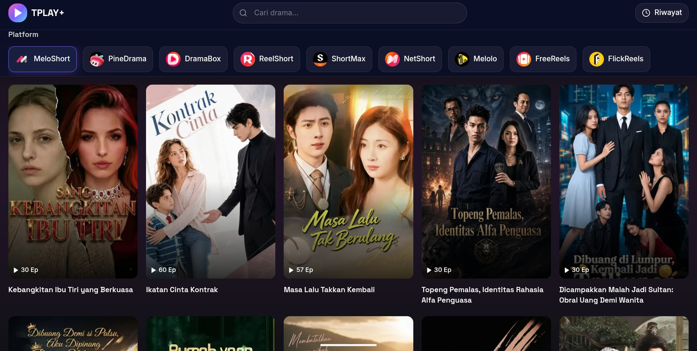

# TPLAY+

[](https://github.com/twidyshop/Tplaysansekai/blob/main/LICENSE)
[](https://github.com/twidyshop/Tplaysansekai)



TPLAY+ adalah platform streaming drama pendek (vertical drama) modern yang menampilkan konten dari berbagai platform populer. Dibangun dengan teknologi web terkini untuk performa maksimal dan pengalaman menonton yang nyaman.

## Persyaratan Sistem
Sebelum memulai, pastikan komputer Anda sudah terinstall:
- [Node.js](https://nodejs.org/) (Versi 18 LTS atau 20 LTS disarankan)
- Git (Opsional)

## Panduan Instalasi (Localhost)

Ikuti langkah-langkah berikut untuk menjalankan project ini di komputer Anda:

### 1. Clone Repository
1. Buka terminal (Command Prompt/PowerShell).
2. Clone repository ini ke komputer Anda:
   ```bash
   git clone https://github.com/twidyshop/Tplaysansekai.git
   ```
3. Masuk ke folder project:
   ```bash
   cd Tplaysansekai
   ```

### 2. Install Dependencies
Install semua library yang dibutuhkan project ini:
```bash
npm install
# atau jika menggunakan yarn
yarn install
# atau pnpm
pnpm install
```

### 3. Konfigurasi Environment Variable
Salin file bernama `.env.example` menjadi `.env`

### 4. Jalankan Development Server
Mulai server lokal untuk pengembangan:
```bash
npm run dev
```

Buka browser dan kunjungi [http://localhost:3000](http://localhost:3000).

## Script Perintah
| Command | Fungsi |
|---------|--------|
| `npm run dev` | Menjalankan server development |
| `npm run build` | Membuat build production |
| `npm run start` | Menjalankan build production |
| `npm run lint` | Cek error coding style (Linting) |

## Struktur Folder
```text
src/
├── app/                    # Halaman & Routing (Next.js App Router)
│   ├── api/                # API Routes untuk integrasi backend
│   ├── detail/             # Halaman detail konten
│   ├── watch/              # Halaman player video
│   └── layout.tsx          # Root layout aplikasi
├── components/             # Reusable UI Components
│   ├── ui/                 # Base components (Shadcn UI)
│   └── layouts/            # Navbar, Footer
├── hooks/                  # Custom React Hooks
├── lib/                    # Helper functions & konfigurasi library
├── types/                  # TypeScript interfaces & types definitions
├── styles/                 # Global CSS & Tailwind configuration
└── app/page.tsx            # Halaman utama
```

## Kustomisasi

### Menghapus Popup Donasi QRIS

Jika Anda ingin menghapus popup donasi yang muncul di halaman detail, Anda dapat memberikan komentar pada pemanggilan komponen `QrisDonationPopup` di dalam file `src/app/detail/layout.tsx`.

Ubah kode berikut:

```tsx
import QrisDonationPopup from '@/components/QrisDonationPopup';

export default function DetailLayout({
  children,
}: {
  children: React.ReactNode;
}) {
  return (
    <>
      {children}
      <QrisDonationPopup />
    </>
  );
}
```

Menjadi seperti ini:

```tsx
import QrisDonationPopup from '@/components/QrisDonationPopup';

export default function DetailLayout({
  children,
}: {
  children: React.ReactNode;
}) {
  return (
    <>
      {children}
      {/* <QrisDonationPopup /> */}
    </>
  );
}
```
